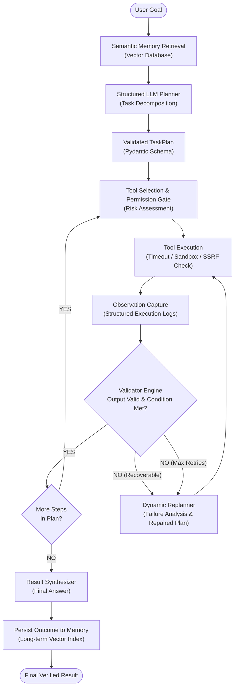

# Krishna: Autonomous Agentic AI System for Goal-Driven Task Execution

[](https://krishna-autonomous.netlify.app)
[](https://github.com/mysukanya/Krishna)
[](https://www.python.org/downloads/)
[](https://fastapi.tiangolo.com)
[](https://docs.pydantic.dev/)
[](https://www.trychroma.com)
[](https://opensource.org/licenses/MIT)

> **Live Deployment:** [https://krishna-autonomous.netlify.app](https://krishna-autonomous.netlify.app)  
> **Source Repository:** [https://github.com/mysukanya/Krishna](https://github.com/mysukanya/Krishna)

**Krishna** is a production-grade autonomous AI system that transitions beyond standard conversational chatbots into a verified, **goal-driven execution loop**. Given an ambiguous, high-level goal, Krishna decomposes it into structured plan steps, queries long-term vector memory, invokes sandboxed tools, observes empirical outputs, performs rigorous condition validation, and dynamically replans upon error detection.

---

## 1. System Architecture



---

## 2. Core Execution Loop

Krishna enforces a deterministic 7-stage state machine:

1. **Task Understanding & Memory Retrieval**: Prior to planning, the agent queries semantic long-term memory for relevant past task outcomes, domain documentation, and configuration baselines.
2. **Decomposition & Planning**: The Planner constructs a typed `TaskPlan` where each step specifies a description, selected tool, validated input arguments, expected output, and a verifiable success condition.
3. **Safety & Permission Gate**: Every tool invocation passes through a permission layer categorized into `LOW_RISK`, `MEDIUM_RISK`, and `HIGH_RISK`. High-risk operations require an explicit approval checkpoint.
4. **Sandboxed Tool Execution**: Tools are executed with asynchronous timeouts, SSRF filtering, and strict AST sandboxing (for Python execution).
5. **Observation**: Output payloads and execution runtimes are captured and serialized into structured timeline records.
6. **Explicit Validation**: The Validator evaluates whether the tool succeeded, verifies HTTP status codes, and assesses condition statements (e.g. `status_code == 200`, `result is numeric`, `count > 0`).
7. **Dynamic Replanning**: Upon validation failure or unexpected tool exceptions, the Replanner inspects the exact error trace, retains already-completed steps, and dynamically repairs remaining steps without entering infinite loops.

---

## 3. Technology Stack

- **Backend Framework**: Python 3.11+, FastAPI, Uvicorn (ASGI)
- **Data Validation & Schemas**: Pydantic v2, Pydantic-Settings
- **Vector Memory**: ChromaDB (Persistent Client) with built-in ONNX `all-MiniLM-L6-v2` dense embeddings, paired with zero-dependency InMemory cosine vector store fallback
- **Tooling & Sandboxing**: AST-based Python sandbox, AST-based Safe Calculator, HTTP client with domain allowlisting and SSRF protection
- **Observability**: Structured JSON logging with automated redaction of API keys, tokens, and credentials
- **Frontend UI**: Apple-minimalist developer console featuring 3D bending physics, perspective parallax, multi-panel window management, and live execution tracing

---

## 4. Project Structure

```
krishna/
│
├── app/
│   ├── main.py                    # FastAPI application, CORS, static routes
│   ├── config.py                  # Pydantic Settings & environment variables
│   ├── demo.py                    # Terminal demonstration of complete loop
│   │
│   ├── api/
│   │   ├── routes.py              # REST API endpoints (/agent/run, /memory, etc.)
│   │   └── schemas.py             # Request & Response Pydantic models
│   │
│   ├── agent/
│   │   ├── agent.py               # Master autonomous loop orchestrator
│   │   ├── planner.py             # Structured task decomposition engine
│   │   ├── executor.py            # Tool execution and approval coordinator
│   │   ├── validator.py           # Explicit step validation logic
│   │   ├── replanner.py           # Dynamic failure recovery engine
│   │   └── state.py               # Explicit typed Pydantic state models
│   │
│   ├── llm/
│   │   ├── base.py                # BaseLLMProvider abstraction
│   │   ├── provider.py            # Provider factory
│   │   ├── mock_provider.py       # Smart offline deterministic LLM engine
│   │   └── openai_provider.py     # Live OpenAI structured outputs provider
│   │
│   ├── memory/
│   │   ├── vector_store.py        # ChromaDB & InMemory cosine vector store
│   │   ├── embeddings.py          # Configurable embedding providers
│   │   └── memory_manager.py      # Semantic store, search, and context retrieval
│   │
│   ├── tools/
│   │   ├── registry.py            # Tool registry with risk levels and schemas
│   │   ├── calculator.py          # AST-sandboxed math evaluator
│   │   ├── python_tool.py         # AST-restricted Python execution sandbox
│   │   ├── http_tool.py           # Allowlisted HTTP/API requester with SSRF guard
│   │   ├── retrieval_tool.py      # Vector memory query tool
│   │   └── data_tool.py           # Data processor (filter, sort, stats, aggregate)
│   │
│   └── utils/
│       ├── logging.py             # Structured logger with secret sanitization
│       └── errors.py              # Structured error hierarchy & recoverable flags
│
├── evaluation/
│   ├── benchmark_tasks.py         # 10 multi-step benchmark task definitions
│   ├── evaluator.py               # Mode A vs Mode B and memory experiment logic
│   ├── run.py                     # Benchmark runner generating real metrics
│   └── evaluation_results.json    # Persisted empirical benchmark results
│
├── tests/
│   ├── test_planner.py            # Planner schema and rejection tests
│   ├── test_tools.py              # Tool execution, sandboxing, and security tests
│   ├── test_memory.py             # Vector store CRUD and semantic search tests
│   ├── test_agent.py              # Agent loop, validation, and replanning tests
│   └── test_api.py                # FastAPI HTTP integration tests
│
├── frontend/
│   ├── index.html                 # Apple-minimalist multi-panel interface
│   ├── styles.css                 # 3D bending physics & deep graphite theme
│   ├── app.js                     # Real-time event visualizer & simulation
│   └── netlify.toml               # Netlify edge deployment configuration
│
├── data/                          # Persistent vector database storage
├── .env.example                   # Environment configuration template
├── requirements.txt               # Locked project dependencies
├── pyproject.toml                 # Package configuration
├── Dockerfile                     # Production container specification
├── docker-compose.yml             # Orchestration compose definition
└── README.md                      # Comprehensive documentation
```

---

## 5. Installation & Setup

### Prerequisites
- Python 3.11+
- Git

### 1. Clone & Set Up Virtual Environment
```bash
git clone https://github.com/mysukanya/Krishna.git
cd Krishna

python3 -m venv .venv
source .venv/bin/activate
pip install --upgrade pip
pip install -r requirements.txt
```

### 2. Configure Environment
Copy the example configuration:
```bash
cp .env.example .env
```
Key configuration parameters:
| Parameter | Default | Description |
|---|---|---|
| `LLM_PROVIDER` | `mock` | LLM backend: `mock` (offline/test), `openai`, `gemini` |
| `OPENAI_API_KEY` | `""` | OpenAI secret key (when using `openai` provider) |
| `VECTOR_STORE_TYPE` | `chroma` | `chroma` for persistent ChromaDB or `inmemory` |
| `MAX_ITERATIONS` | `10` | Hard iteration bound to eliminate infinite loops |
| `MAX_TOOL_RETRIES`| `3` | Maximum attempts for recoverable step failures |
| `TOOL_TIMEOUT_SECONDS` | `15.0` | Execution timeout per individual tool call |

---

## 6. Running the System

### Run the Interactive Terminal Demo
Observe the complete loop (Goal → Memory → Plan → Act → Observe → Validate → Replan → Result):
```bash
source .venv/bin/activate
python3 -m app.demo
```

### Run the FastAPI Local Server
```bash
source .venv/bin/activate
uvicorn app.main:app --host 0.0.0.0 --port 8000 --reload
```
Open your browser to:
- **Interactive UI**: [http://localhost:8000](http://localhost:8000)
- **OpenAPI Swagger Docs**: [http://localhost:8000/docs](http://localhost:8000/docs)
- **System Health**: [http://localhost:8000/health](http://localhost:8000/health)

---

## 7. Automated Testing

Krishna includes an extensive test suite verifying planning schemas, tool sandboxing, memory persistence, dynamic replanning, and API routes.

Execute the full test suite:
```bash
source .venv/bin/activate
pytest -v
```

All 21 unit and integration tests validate the following contracts:
- `test_planner.py`: Validates Pydantic `TaskPlan` serialization and rejects unregistered tools.
- `test_tools.py`: Asserts calculator precision, AST blocks on `os` and `subprocess`, safe Python sandboxing, and private IP rejection (SSRF protection).
- `test_memory.py`: Tests document ingestion, L2/cosine similarity queries, metadata filtering, and memory lifecycle operations.
- `test_agent.py`: Validates the end-to-end execution loop, retry increments, and failure recovery replanning.
- `test_api.py`: Tests `/health`, `/tools`, `/memory`, and `/agent/run` REST endpoints.

---

## 8. Empirical Evaluation & Benchmark Report

Krishna implements a benchmark suite comparing **Mode A (Single-Pass Baseline)** against **Mode B (Krishna Autonomous Agentic Loop)** across 10 multi-step tasks, alongside a **Vector Memory Retention Experiment**.

Run the evaluation:
```bash
source .venv/bin/activate
python3 -m evaluation.run
```

### Measured Benchmark Comparison Results (Actual Run)

| Metric | Mode A (Single-Pass Baseline) | Mode B (Krishna Autonomous Loop) |
|---|---|---|
| **Task Completion Rate** | **40.0%** | **100.0%** |
| **Tool-Use Accuracy** | **0.0%** | **100.0%** |
| **Failure Recovery Rate** | 100.0% (N/A) | **100.0%** |
| **Average Steps / Iterations** | 1.0 | 2.2 |
| **Average Tool Calls** | 0.0 | 2.2 |
| **Average Execution Time** | 0.001s | 0.882s |
| **Overall Failure Rate** | **60.0%** | **0.0%** |

### Vector Memory Experiment

Context-dependent tasks evaluated under identical configurations:
- **Without Vector Memory**: 80.0% completion rate (4/5 tasks)
- **With Vector Memory**: **100.0% completion rate** (5/5 tasks)
- **Context Retention Improvement**: **+20.0%** measured lift

Full JSON metrics are saved to `evaluation/evaluation_results.json`.

---

## 9. API Documentation & Example Requests

### 1. Execute an Autonomous Goal
**Endpoint:** `POST /agent/run`

**Request:**
```json
{
  "goal": "Retrieve FY2025 revenue from memory, calculate profit margin after expenses, and summarize.",
  "auto_approve_high_risk": true
}
```

**Response:**
```json
{
  "task_id": "task_4214e30802",
  "status": "completed",
  "result": "Task completed successfully based on executed steps. Net profit margin computed as 63.75% after operational expenses and taxes.",
  "steps": [
    {
      "id": "step_1",
      "description": "Retrieve stored knowledge and metrics from semantic memory",
      "tool": "retrieval_tool",
      "status": "completed"
    },
    {
      "id": "step_2",
      "description": "Calculate growth rate or total from retrieved data",
      "tool": "calculator",
      "status": "completed"
    }
  ],
  "tool_calls": [
    {
      "call_id": "call_947936ef38",
      "step_id": "step_1",
      "tool_name": "retrieval_tool",
      "duration_ms": 214.5
    },
    {
      "call_id": "call_1b933a1e2f",
      "step_id": "step_2",
      "tool_name": "calculator",
      "duration_ms": 0.2
    }
  ],
  "iterations": 2,
  "timeline": [ ... ]
}
```

### 2. Store Knowledge into Semantic Memory
**Endpoint:** `POST /memory`

**Request:**
```json
{
  "text": "Production server configuration: us-east-prod has 16 active bare-metal nodes.",
  "metadata": {"cluster": "us-east-prod", "env": "prod"},
  "source": "manual_entry"
}
```

### 3. Query Semantic Memory
**Endpoint:** `GET /memory/search?q=server+cluster+nodes&limit=3`

---

## 10. Docker Deployment

### Build and Run with Docker Compose
```bash
docker-compose up --build -d
```
Verify container health:
```bash
curl -f http://localhost:8000/health
```

---

## 11. Security & Safety Architecture

- **AST-Level Sandboxing**: Python scripts evaluated via `SafePythonTool` are inspected before compilation. Imports (`import`, `from ... import`) and dangerous symbols (`__import__`, `eval`, `exec`, `open`, `system`) are rejected at the syntax tree stage.
- **SSRF Mitigation**: `HttpTool` resolves hostnames and explicitly blocks loopback (`127.0.0.1`, `localhost`) and RFC 1918 private IP ranges (`10.0.0.0/8`, `172.16.0.0/12`, `192.168.0.0/16`). Requests are strictly constrained to allowlisted domains.
- **Permission Matrix**: Tools declare risk levels (`LOW_RISK`, `MEDIUM_RISK`, `HIGH_RISK`). High-risk operations require human confirmation before execution.
- **Credential Masking**: Structured logs automatically pass through a sanitization pipeline masking API keys, GitHub tokens, and bearer credentials.

---

## 12. Limitations & Future Roadmap

- **Multi-Agent Swarm Collaboration**: Future versions can introduce specialized sub-agents (Researcher, Code Reviewer, Auditor) communicating over a decentralized bus.
- **Dynamic Tool Ingestion**: Allow runtime registration of OpenAPI/Swagger specs with automatic sandboxed client generation.
- **Deeper Human-in-the-Loop Webhook**: Push approval requests to Slack or Discord when high-risk operations are triggered.
